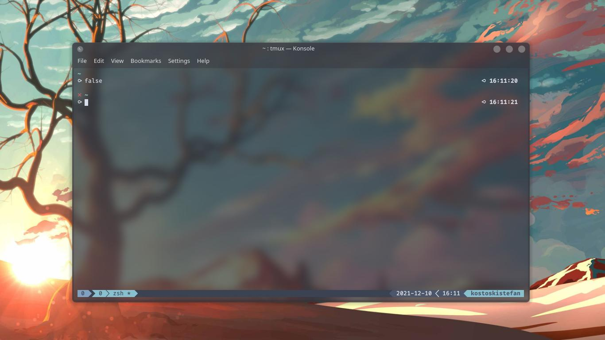

# Scythe

Scythe is a minimal Oh-My-Zsh theme

## Preview

#### Initial view

#### Failed command

#### Git support

_Disclaimer: The bottom bar is part of a TMux theme. It is not included in this repository!_

## Requirements

* ZShell
* Oh-My-Zsh

## Installation

* Clone this repository: 

  `git clone https://github.com/kostoskistefan/scythe ~/.oh-my-zsh/custom/themes/scythe`

* Add the following line in your `.zshrc` file: `ZSH_THEME="scythe/scythe"`
* Restart your terminal or run `source ~/.zshrc`
